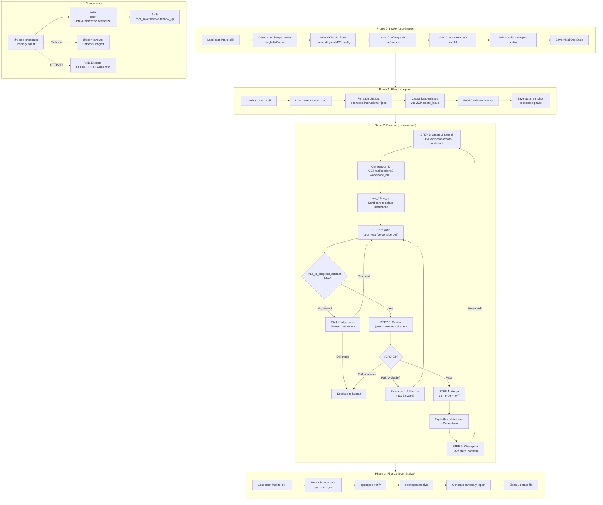
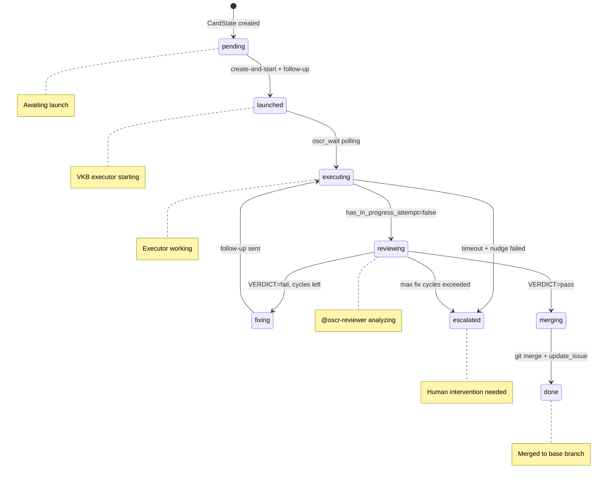
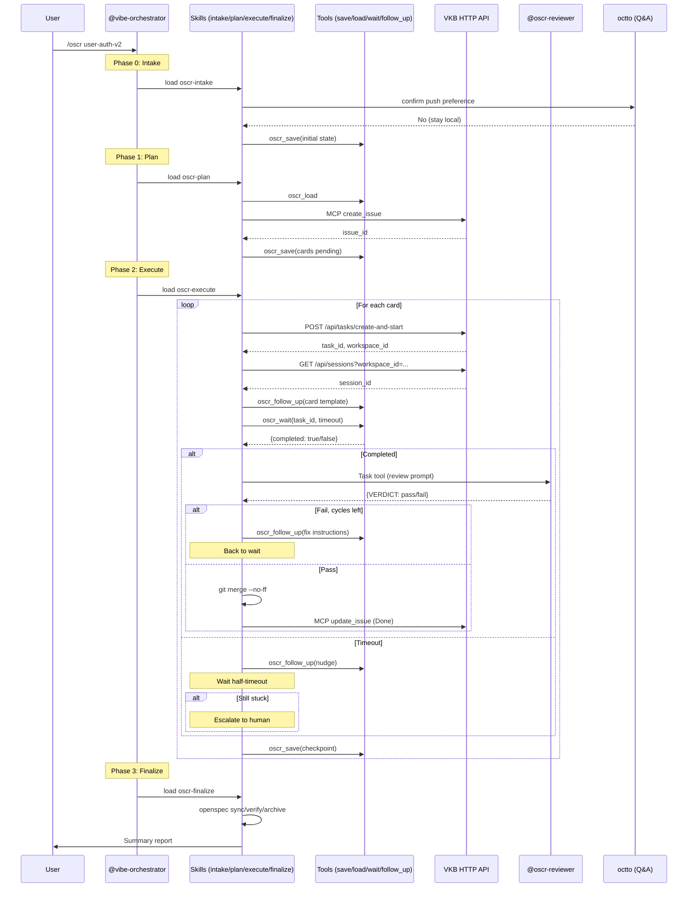

# OSCR Orchestration Workflow



# Card State Machine



# Agent Interaction Sequence



# Tool Data Flow

```mermaid
flowchart LR
    subgraph State["State Management"]
        S1[oscr_save]
        S2[oscr_load]
        SF[(".opencode/.oscr-state.json")]
    end
    
    subgraph VKB["VKB Integration"]
        W1[oscr_wait]
        W2[oscr_follow_up]
        API[("VKB HTTP API<br/>/api/tasks<br/>/api/sessions")]
    end
    
    subgraph OscrState["OscrState"]
        ST1[runId, phase]
        ST2[config]
        ST3[cards: CardState[]]
    end
    
    S1 --> SF
    SF --> S2
    S2 --> ST1
    S2 --> ST2
    S2 --> ST3
    
    W1 --> API
    W2 --> API
    
    API -->|task status| W1
    API -->|session follow-up| W2
```
