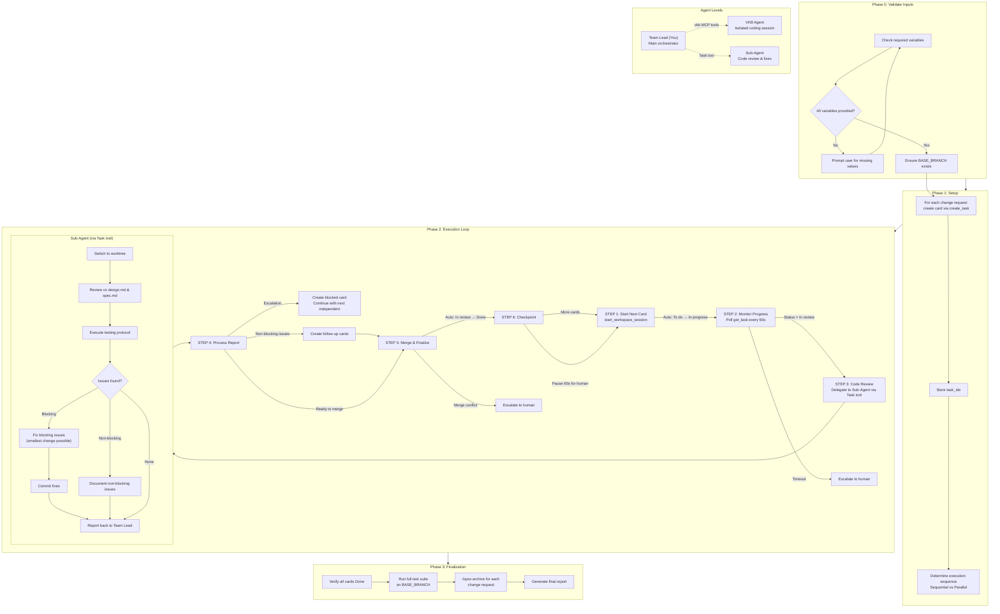
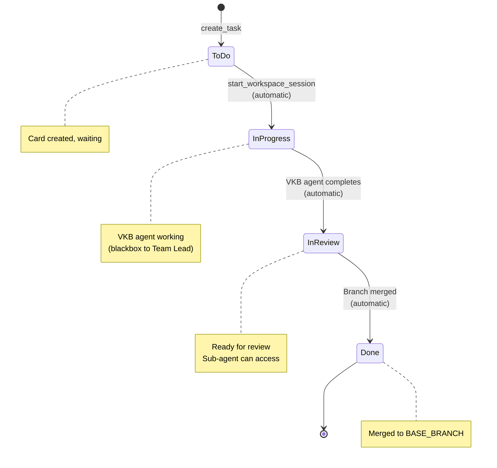
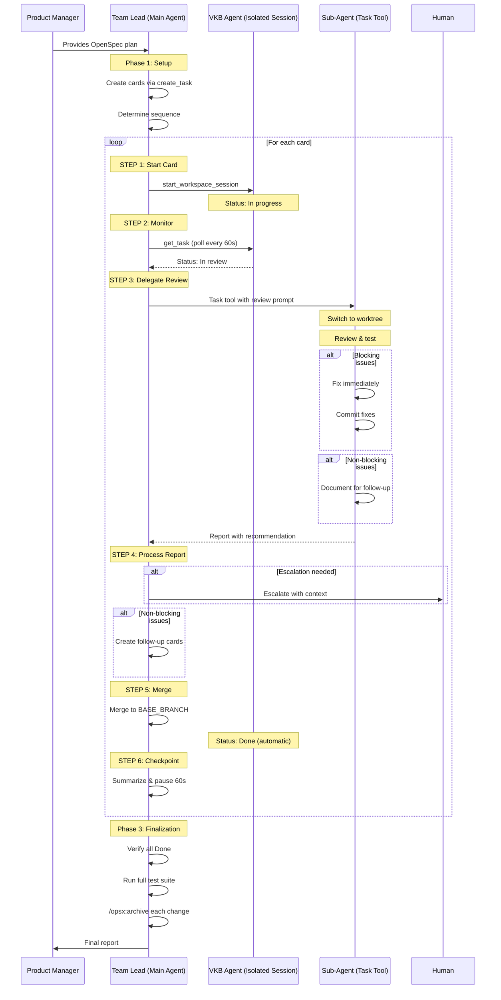

# E2E Workflow

```mermaid
flowchart TD
    subgraph Phase0["Phase 0: Validate Inputs"]
        V1[Check required variables]
        V2{All variables provided?}
        V1 --> V2
        V2 -->|No| V3[Prompt user for missing values]
        V3 --> V1
        V2 -->|Yes| P1
    end

    subgraph Phase1["Phase 1: Setup"]
        P1[Ensure BASE_BRANCH exists]
        P2[For each change request:<br/>create card via create_task]
        P3[Store task_ids]
        P4[Determine execution sequence<br/>Sequential vs Parallel]
        P1 --> P2 --> P3 --> P4
    end

    subgraph Phase2["Phase 2: Execution Loop"]
        S1["STEP 1: Start Next Card<br/>start_workspace_session"]
        S2["STEP 2: Monitor Progress<br/>Poll get_task every 60s"]
        S3["STEP 3: Code Review<br/>Delegate to Sub-Agent via Task tool"]
        S4["STEP 4: Process Report"]
        S5["STEP 5: Merge & Finalize"]
        S6["STEP 6: Checkpoint"]
        
        S1 -->|Auto: To do → In progress| S2
        S2 -->|Status = In review| S3
        S2 -->|Timeout| E1[Escalate to human]
        
        subgraph SubAgent["Sub-Agent (via Task tool)"]
            SA1[Switch to worktree]
            SA2[Review vs design.md & spec.md]
            SA3[Execute testing protocol]
            SA4{Issues found?}
            SA5["Fix blocking issues<br/>(smallest change possible)"]
            SA6[Document non-blocking issues]
            SA7[Commit fixes]
            SA8[Report back to Team Lead]
            
            SA1 --> SA2 --> SA3 --> SA4
            SA4 -->|Blocking| SA5 --> SA7 --> SA8
            SA4 -->|Non-blocking| SA6 --> SA8
            SA4 -->|None| SA8
        end
        
        S3 --> SubAgent
        SubAgent --> S4
        
        S4 -->|Escalation| E2[Create blocked card<br/>Continue with next independent]
        S4 -->|Non-blocking issues| S4a[Create follow-up cards]
        S4a --> S5
        S4 -->|Ready to merge| S5
        
        S5 -->|Auto: In review → Done| S6
        S5 -->|Merge conflict| E3[Escalate to human]
        
        S6 -->|More cards| S1
        S6 -->|Pause 60s for human| S1
    end

    subgraph Phase3["Phase 3: Finalization"]
        F1[Verify all cards Done]
        F2[Run full test suite<br/>on BASE_BRANCH]
        F3["/opsx:archive for each<br/>change request"]
        F4[Generate final report]
        F1 --> F2 --> F3 --> F4
    end

    Phase0 --> Phase1 --> Phase2 --> Phase3

    subgraph Legend["Agent Levels"]
        L1["Team Lead (You)<br/>Main orchestrator"]
        L2["VKB Agent<br/>Isolated coding session"]
        L3["Sub-Agent<br/>Code review & fixes"]
        L1 -.->|vkb MCP tools| L2
        L1 -.->|Task tool| L3
    end
```

# Status Transition Workflow

```mermaid
stateDiagram-v2
    [*] --> ToDo: create_task
    ToDo --> InProgress: start_workspace_session<br/>(automatic)
    InProgress --> InReview: VKB agent completes<br/>(automatic)
    InReview --> Done: Branch merged<br/>(automatic)
    Done --> [*]
    
    note right of ToDo: Card created, waiting
    note right of InProgress: VKB agent working<br/>(blackbox to Team Lead)
    note right of InReview: Ready for review<br/>Sub-agent can access
    note right of Done: Merged to BASE_BRANCH

```

# Agent Interaction Sequence Diagram

```mermaid
sequenceDiagram
    participant PM as Product Manager
    participant TL as Team Lead (Main Agent)
    participant VKB as VKB Agent (Isolated Session)
    participant SA as Sub-Agent (Task Tool)
    participant Human as Human

    PM->>TL: Provides OpenSpec plan
    
    Note over TL: Phase 1: Setup
    TL->>TL: Create cards via create_task
    TL->>TL: Determine sequence
    
    loop For each card
        Note over TL: STEP 1: Start Card
        TL->>VKB: start_workspace_session
        Note over VKB: Status: In progress
        
        Note over TL: STEP 2: Monitor
        TL->>VKB: get_task (poll every 60s)
        VKB-->>TL: Status: In review
        
        Note over TL: STEP 3: Delegate Review
        TL->>SA: Task tool with review prompt
        
        Note over SA: Switch to worktree
        Note over SA: Review & test
        alt Blocking issues
            SA->>SA: Fix immediately
            SA->>SA: Commit fixes
        end
        alt Non-blocking issues
            SA->>SA: Document for follow-up
        end
        SA-->>TL: Report with recommendation
        
        Note over TL: STEP 4: Process Report
        alt Escalation needed
            TL->>Human: Escalate with context
        end
        alt Non-blocking issues
            TL->>TL: Create follow-up cards
        end
        
        Note over TL: STEP 5: Merge
        TL->>TL: Merge to BASE_BRANCH
        Note over VKB: Status: Done (automatic)
        
        Note over TL: STEP 6: Checkpoint
        TL->>TL: Summarize & pause 60s
    end
    
    Note over TL: Phase 3: Finalization
    TL->>TL: Verify all Done
    TL->>TL: Run full test suite
    TL->>TL: /opsx:archive each change
    TL->>PM: Final report

```

